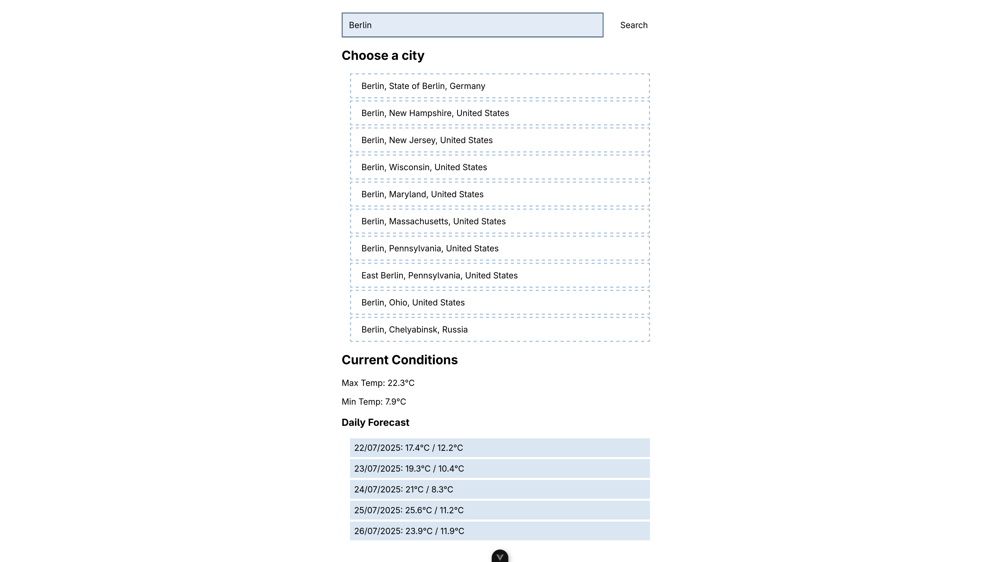

# Weather Forecast App

An expense tracker app built with Vue 3 and the composition API.

1. Search for locations using an API (e.g.,`https://geocoding-api.open-meteo.com/v1/search?name=Berlin&count=10&language=en&format=json`).
2. Fetch and display daily weather forecasts and current conditions (e.g.,`https://api.open-meteo.com/v1/forecast?latitude=55.7522&longitude=37.6156&hourly=temperature_2m&start_date=2024-04-02&end_date=2024-04-03`).
3. Present the forecast in a user-friendly format (a simple list or chart).

## Table of contents

- [Links](#links)
- [Screenshot](#screenshot)
- [Built with](#built-with)

## Links

- Live Site URL: [Weather Forecast App](https://task3-weather-app.netlify.app/)

### Screenshot

## Built with

- Vue 3 + Composition API
- TypeScript
- HTML
- CSS
